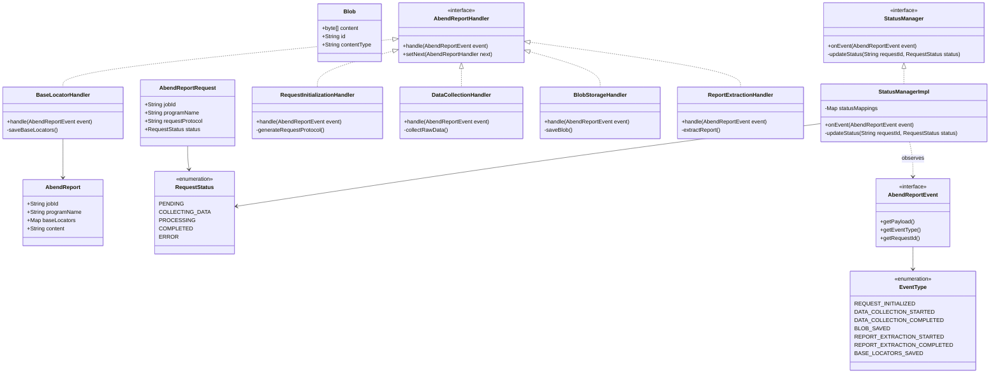
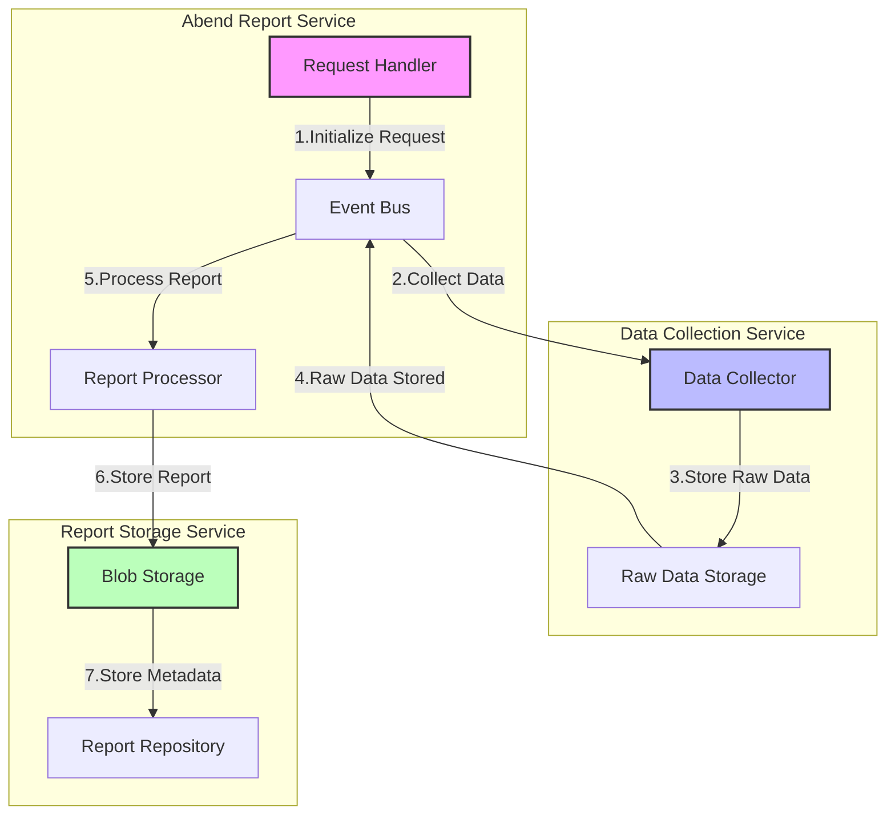

# Abend Report Workflow Documentation (TODO)

## Core Domain Class Diagram

### Class/Interface Descriptions

1. **AbendReportHandler (Interface)**
   - Core interface for the Chain of Responsibility pattern
   - Focuses solely on processing logic
   - No status management responsibility

2. **AbendReportEvent (Interface)**
   - Represents events flowing through the system
   - Carries payload and event type information
   - Includes request ID for tracking

3. **EventType (Enumeration)**
   - Defines all possible events in the workflow
   - Allows for easy addition of new event types
   - Used by StatusManager for status mapping

4. **StatusManager (Interface)**
   - Responsible for status management
   - Observes events and updates status accordingly
   - Decoupled from handlers

5. **StatusManagerImpl**
   - Implements status management logic
   - Maintains mappings between events and statuses
   - Single source of truth for status updates

6. **RequestInitializationHandler**
   - Handles initial request creation
   - Generates unique request protocol
   - Emits REQUEST_INITIALIZED event

7. **DataCollectionHandler**
   - Responsible for collecting raw data
   - Emits events for collection start/completion
   - Produces Blob containing raw data

8. **BlobStorageHandler**
   - Manages blob storage operations
   - Emits BLOB_SAVED event
   - Returns blob ID

9. **ReportExtractionHandler**
   - Processes blob data to extract AbendReport
   - Emits extraction start/completion events
   - Creates structured AbendReport object

10. **BaseLocatorHandler**
    - Final handler in the chain
    - Saves base locators from AbendReport
    - Emits BASE_LOCATORS_SAVED event

## Microservices Architecture

### Microservices Description

1. **Abend Report Service**
   - Handles request initialization
   - Orchestrates the overall process
   - Manages report extraction and processing

2. **Data Collection Service**
   - Specialized in raw data collection
   - Handles data storage and retrieval
   - Isolated from report processing concerns

3. **Report Storage Service**
   - Manages blob storage
   - Handles report persistence
   - Stores base locators and metadata

The microservices architecture provides:
- Better scalability
- Independent deployment
- Specialized concerns
- Fault isolation
- Enhanced maintainability
