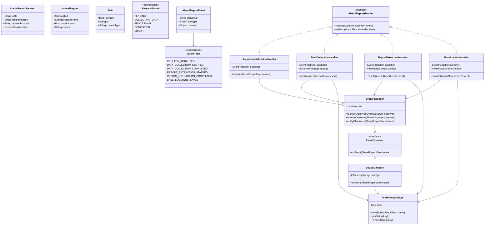

# Abend Report Workflow Documentation (TODO)

## Core Domain Class Diagram

### Class/Interface Descriptions

1. **EventPublisher**
   - Central event management
   - Maintains list of observers
   - Notifies observers of workflow events

2. **EventObserver**
   - Interface for components that need to react to events
   - Implemented by StatusManager and other observers

3. **InMemoryStorage**
   - Simple key-value store for workflow data
   - Maintains state during request processing
   - Used by handlers to store/retrieve data

4. **AbendReportHandler**
   - Chain of Responsibility interface
   - Each handler processes its part and publishes events
   - Uses InMemoryStorage for data persistence

5. **StatusManager**
   - Observes workflow events
   - Updates request status in storage
   - Single source of truth for status

6. **Handlers**
   - RequestInitializationHandler: Creates new requests
   - DataCollectionHandler: Collects raw data
   - ReportExtractionHandler: Processes data into report
   - BaseLocatorHandler: Saves base locators

### Workflow

1. Request comes in → RequestInitializationHandler
2. Events flow through handlers via Chain of Responsibility
3. StatusManager observes events and updates status
4. Data passed between handlers using InMemoryStorage
5. Each step publishes events on completion

This simplified design:
- Runs entirely in one service
- Uses Observer pattern for event handling
- Stores all data in memory
- Maintains loose coupling through events
- Keeps single responsibility principle
